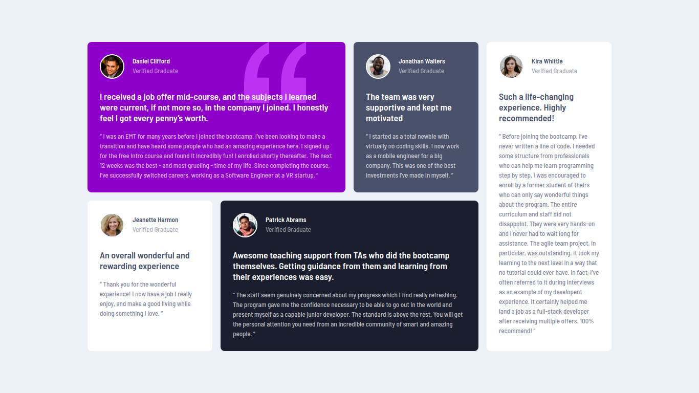

# Frontend Mentor - Testimonials grid section

## Welcome! 👋

Thanks for checking out this front-end coding challenge.

[Frontend Mentor](https://www.frontendmentor.io) challenges help you improve your coding skills by building realistic projects.

**To do this challenge, you need a basic understanding of HTML and CSS.**

## The challenge

Your challenge is to build out this testimonials grid section and get it looking as close to the design as possible.

You can use any tools you like to help you complete the challenge. So if you've got something you'd like to practice, feel free to give it a go.

Your users should be able to:

- View the optimal layout for the site depending on their device's screen size

Want some support on the challenge? [Join our Slack community](https://www.frontendmentor.io/slack) and ask questions in the **#help** channel.

### Screenshot

### Links

- Solution URL: [https://github.com/donosti1/fm-testimonials-grid-section](https://github.com/donosti1/fm-testimonials-grid-section)

## My process

### Built with
- Flexbox
- CSS Grid
- Mobile-first workflow
- [React](https://reactjs.org/) - JS library
- [Chakra UI](https://chakra-ui.com/) - React Component library

## Author

- Frontend Mentor - [@donosti1](https://www.frontendmentor.io/profile/donosti1)
- Github - [@donosti1](https://github.com/donosti1)

